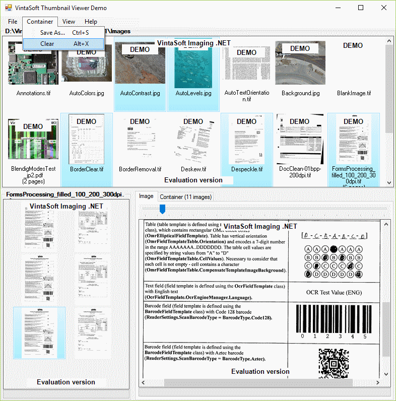

# VintaSoft WinForms Thumbnail Viewer Demo

This C# project uses <a href="https://www.vintasoft.com/vsimaging-dotnet-index.html">VintaSoft Imaging .NET SDK</a> and demonstrates how to view thumbnails of images and document pages in WinForms:
* Synchronous work of "folder" thumbnail viewer, "file" thumbnail viewer and image viewer.
* Preview thumbnails of all supported image and document files in the "folder" thumbnail viewer.
* Preview thumbnails of all pages of selected image or document file in the "file" thumbnail viewer.
* Preview image of selected page of selected file in the image viewer.
* Change viewer settings for the "folder" and "file" thumbnail viewers.
* Drag-and-drop images from any viewer to the "container" thumbnail viewer.
* Save images from the "container" thumbnail viewer to any supported multipage image file format or PDF.


## Screenshot



## Usage
1. Get the 30 day free evaluation license for <a href="https://www.vintasoft.com/vsimaging-dotnet-index.html" target="_blank">VintaSoft Imaging .NET SDK</a> as described here: <a href="https://www.vintasoft.com/docs/vsimaging-dotnet/Licensing-Evaluation.html" target="_blank">https://www.vintasoft.com/docs/vsimaging-dotnet/Licensing-Evaluation.html</a>

2. Update the evaluation license in "CSharp\MainForm.cs" file:
   ```
   Vintasoft.Imaging.ImagingGlobalSettings.Register("REG_USER", "REG_EMAIL", "EXPIRATION_DATE", "REG_CODE");
   ```

3. Build the project ("ThumbnailViewerDemo.Net8.csproj" file) in Visual Studio or using .NET CLI:
   ```
   dotnet build ThumbnailViewerDemo.Net8.csproj
   ```

4. Run compiled application and try to view thumbnails of images and document pages.


## Documentation
VintaSoft Imaging .NET SDK on-line User Guide and API Reference for .NET developer is available here: https://www.vintasoft.com/docs/vsimaging-dotnet/


## Support
Please visit our <a href="https://myaccount.vintasoft.com/">online support center</a> if you have any question or problem.
